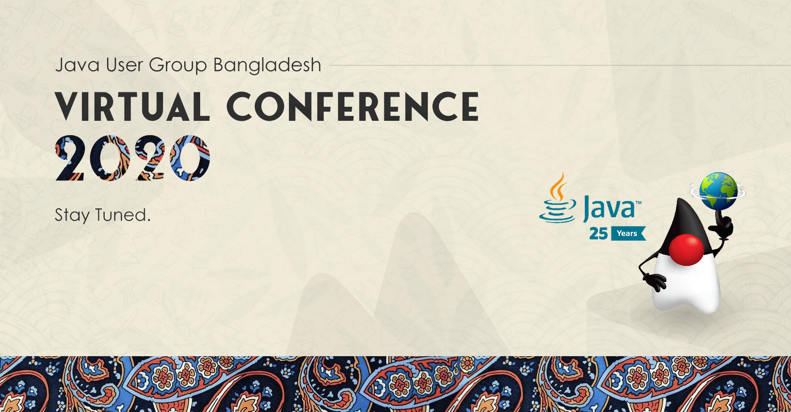

It is settled now. We are doing a virtual conference from JUGBD. The tentative timeline would be in the middle of June. 

## Call for papers is now Open. 

If you have something unique and exciting topic that you would like to share with your fellow developers, students, write a proposal, and submit a pull request in this git repository,  We will review it and provide feedback if necessary and then merge it. 

Here is some guideline for your proposal. 

The pull request would be a file in markdown format. The file will contain a title, abstract, track, session type, and experience level. 

**Title*:** Maximum character limit is 70 characters

**Abstract*:** Maximum character limit is 500 characters

**Track*:** Here are some tracks that we would be interested in but not limited to these only 
1. Anything and everything about java, language feature, JDK internals, popular tools, framework, etc
2. Coding practices, general software engineering, development methodology, team culture, etc 
3. Building Software on cloud, containers, and infrastructure, etc

**Experience Level*:** Mention the experience level of the target attendee
